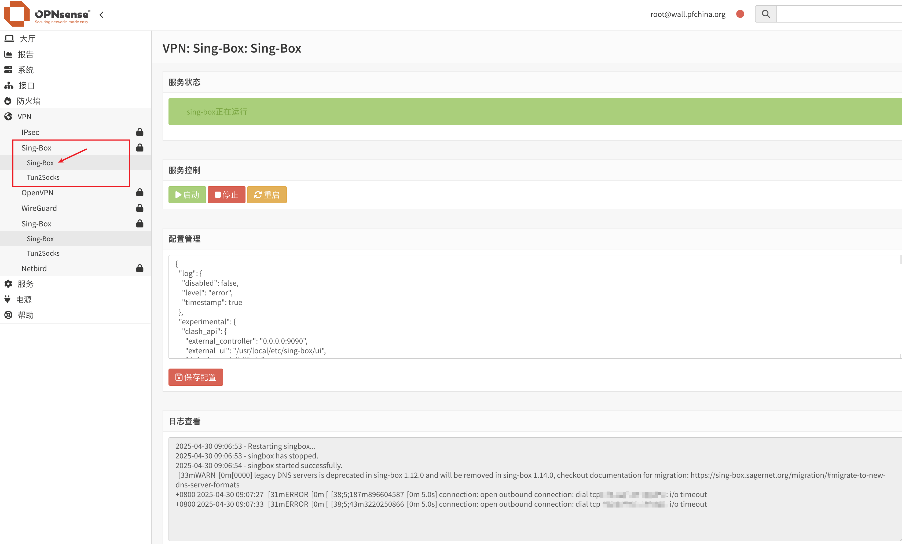

## Sing-box for OPNsense
!!!!!Перевод не окончен.<br />
Форк от https://github.com/Opnwall/Sing-Box-for-OPNsense<br />
Добавлен только перевод для удобства пользования.

Установщик для sing-box.
Прошел тест на OPNsense 25.1.5.



## Исходный код проекта
Проект объединяет следующие инструменты：

[Sing-Box](https://github.com/SagerNet/sing-box) 

[MetaCubeXD](https://github.com/MetaCubeX/metacubexd) 

[Hev-Socks5-Tunnel](https://github.com/heiher/hev-socks5-tunnel)

## Меры предосторожности
1. В настоящее время поддерживается только платформа x86_64.
2. Скрипт не предоставляет никакой информации об узле, пожалуйста, подготовьте свой собственный конфигурационный файл.
3. Скрипт автоматически добавит интерфейс tun, псевдоним china_ip и правила перенаправления и может быть изменен вручную после завершения установки.
4. В скрипт интегрирована доступная конфигурация по умолчанию, и вам нужно только дополнить часть outbounds конфигурации sing-box, чтобы использовать ее.
5. Чтобы уменьшить количество журналов, сохраняемых для долговременной работы, после завершения отладки, пожалуйста, измените все настроенные типы журналов 

## Способ установки
После загрузки распакуйте, загрузите в корневой каталог, войдите в каталог установки и выполните следующую команду для установки：

```bash
sh install.sh
```


## Способ удаления
Для удаления выполните следующую команду：

```bash
sh uninstall.sh
```


